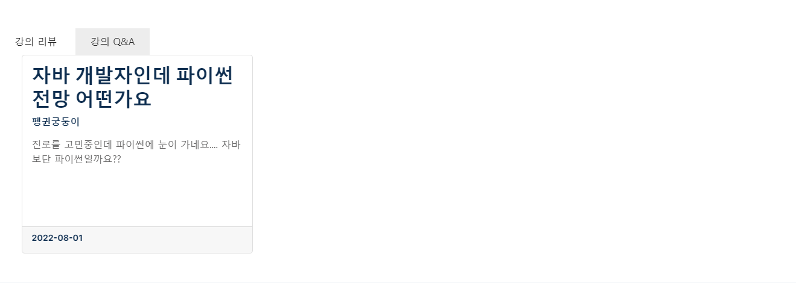
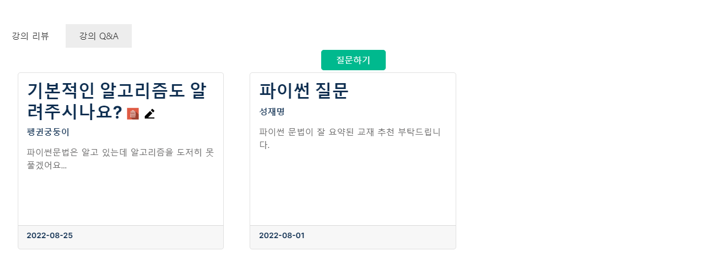

# Learning Machine

<h3> IT 교육 컨텐츠를 제공하는 웹 사이트</h3>
<small>제작기간 : 2022.07.04 ~ 2022.08.01</small> <br>
<small>개발자 : <a href = "https://github.com/IkhyeonAhn">안익현</a>, <a href="https://github.com/Hijineee">이희진</a>,  <a href = "https://github.com/skek3039">명재성</a>, <a href="https://github.com/Moonmaji">문형석</a>, <a href="https://github.com/ParkGuTy">박성균</a></small>

 - ## **개발 환경**
  ```
  OS : Windows 11<br>
  IDE : Eclipse 4.23.0, VisualStudio Code, MySQL Workbench
  Server(WAS) : Tomcat 9.0
  Database : MariaDB 10.7
  Lanuage : JAVA(Oracle JDK 11)
  Framework : Spring 4.3.25.RELEASE
  ```
 - ## **프로젝트 주요화면**

  ### 메인화면

 + 로그인을 하지않은 상태의 메인페이지입니다.
	- 관리자와 강사 권한을 가진 유저도 사진과 같이 출력됩니다.
	- 강의 살펴보기를 누르면  강의목록으로 이동합니다.


 + 로그인을 한 상태의 메인 페이지입니다.
	- 운영자와 관리자권한을 가진 유저는 로그인 하지않은 상태의 메인페이지로 처리됩니다.)
 

 + 메인페이지에서 내 질문을 클릭했을 때의 모달창입니다.
	- 내가 동영상에서 질문했던 내용들이 출력됩니다.
	- 내가 했던 질문에 답이 달렸을 경우에는 사진과 같이 수정버튼이 나타나지 않습니다.


 + 매인화면에서 최근들은 강의를 클릭하면 나오는 모달창입니다.
	 - 내가 최근에 들은 동영상리스트를 들은 날짜 기준으로 내림차순 정렬하여 보여줍니다.
	 - 영상 제목을 클릭하면 해당 링크로 이동합니다.
 
  ### 강의목록

  + 로그인 하지않았을 경우의 강의 목록입니다.
 	 - 인기강의 / 최신강의 메뉴탭을 이용하여 강의들을 살펴볼 수 있습니다.
 	 - 인기 강의는 강의를 현재 수강하고 있는 학생들의 수를 기준으로 내림차순 정렬됩니다.
 	 - 최신 강의는 강의가 등록 된 날짜를 기준으로 내림차순 정렬됩니다.
 	 - 로그인을 하지않은 상태에서 찜하기(하트)버튼을 누르면 로그인창으로 이동합니다.
 

 + 로그인을 했을 경우의 강의목록입니다.
 	 - 내가 결제했던 강의는 강의완료로 표시되며, 클릭하면 강의실로 이동합니다.
 	 - 찜하기를 누르면 하트가 화면과 같이 색이 채워지며 찜하기가 됩니다.
 
 ###  강의실

 + 로그인하지 않은 상태의 강의실입니다.
	 - 강의 정보가 화면과 같이 출력됩니다.
	 - 강의에 대한 평점이 표시됩니다.
	 - 로그인을 하지 않았을 경우 쪽지 및 결제하기 버튼을 누르면 로그인창으로 이동됩니다.


 + 로그인 한 상태의 강의실입니다.
	  - 결제하지 않은 강의라면 결제하기 버튼이 출력됩니다.
	  - 결제한 강의라면 처음부터 듣기 버튼만 출력됩니다.
	  - 결제한 상태에서 듣고 있던 강의가 있다면 이어듣기 버튼이 출력됩니다.



 + 로그인하지 않은 상태의 리뷰(강의실페이지), Q&A 기능입니다.
	  - 리뷰를 조회할 수 있습니다.
	  - Q&A를 조회할 수 있습니다.
	  - 로그인을 하지 않았기 때문에 작성버튼이 표시되지 않습니다.
	


  + 로그인한 상태의 리뷰(강의실페이지), Q&A 기능입니다.
	  - 구매를 한 강의라면 리뷰작성버튼이 표시되며 리뷰를 작성할 수 있습니다.
	  - 구매를 하지 않은 강의여도 Q&A를 최대 3개까지 작성할 수 있습니다.
	  - 리뷰와 Q&A모두 본인이 작성한 것이라면 수정, 삭제를 할 수 있습니다.
	  - 리뷰 삭제는 평점 반영과 악의적인 수정을 방지하기 위해 데이터베이스에서 삭제되지 않습니다.
	  - 리뷰는 삭제하면 다시 작성할 수 없습니다.
	
 ###  강의 결제

 + 강의 결제페이지입니다.
	  - Iamport의 카카오페이를 활용하여 강의 결제를 진행합니다.
	  - 이미 구매한 강의라면 해당 강의의 강의실페이지로 이동합니다.
	  - 
 ###  강의 영상


  + 강의 수강페이지입니다.
	  - 결제한 강의라면 출석처리가 됩니다.
	  - 결제한 강의라면 영상 질문 작성버튼이 출력 되고, 질문을 작성할 수 있습니다.
	  - 결제를 하지 않거나, 로그인을 하지 않은 경우 영상을 3개만 미리보기할 수 있습니다.
	  - 만약 미리보기 영상이 아닌 영상 듣기를 클릭하면, 로그인 페이지 혹은 결제 페이지로 이동합니다.
