# Learning Machine

<h3> IT 교육 컨텐츠를 제공하는 웹 사이트</h3>
<small>제작기간 : 2022.07.04 ~ 2022.08.01</small> <br>
<small>개발자 : <a href = "https://github.com/IkhyeonAhn">안익현</a>, <a href="https://github.com/Hijineee">이희진</a>,  <a href = "https://github.com/skek3039">명재성</a>, <a href="https://github.com/Moonmaji">문형석</a>, <a href="https://github.com/ParkGuTy">박성균</a></small>
<hr>

 - ## **개발 환경**
    ```
    OS : Windows 11<br>
    IDE : Eclipse 4.23.0, VisualStudio Code,MySQL Workbench<br>
    Server(WAS) : Tomcat 9.0<br>
    Database : MariaDB 10.7<br>
    Lanuage : JAVA(Oracle JDK 11)<br>
    Framework : Spring 4.3.25.RELEASE<br>
    ```
 - ## **프로젝트 주요화면**

    - ### 메인화면
 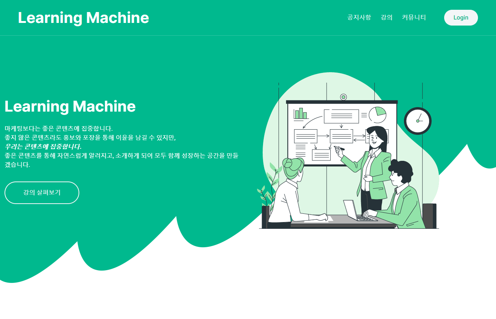
        - 로그인을 하지않은 상태의 메인페이지입니다.
 
 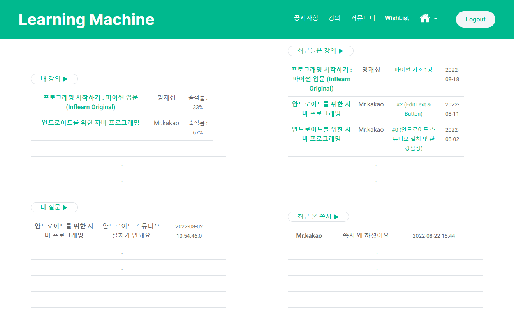
 로그인을 한 상태의 메인 페이지<br>
 (운영자와 관리자권한을 가진 유저는 로그인 하지않은 상태의 메인페이지로 처리됩니다.)
 
 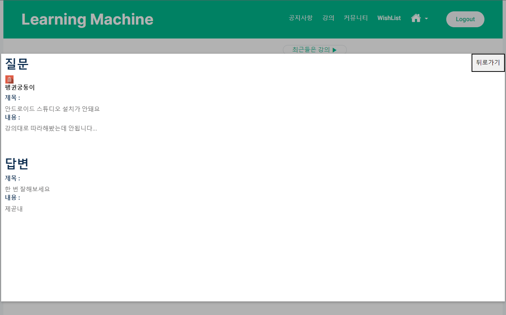
 내가 동영상에서 질문했던 내용들이 출력됩니다.<br>
 내가 했던 질문에 답이 달렸을 경우에는 사진과 같이 수정버튼이 나타나지 않습니다.
 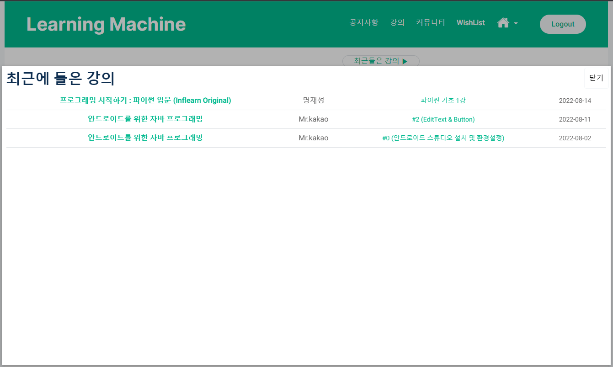
 내가 최근에 들은 동영상리스트를 들은 날짜 기준으로 내림차순 정렬하여 보여줍니다.<br><br>
 
 ###  * 강의목록
 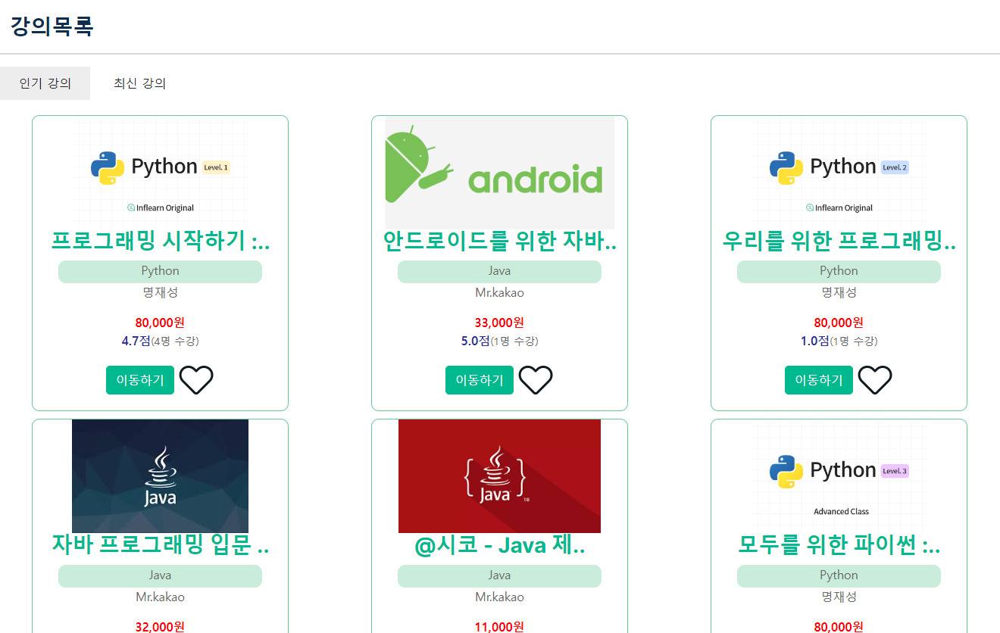
 인기강의 / 최신강의 메뉴탭을 이용하여 강의들을 살펴볼 수 있습니다.<br>
 인기 강의는 강의를 현재 수강하고 있는 학생들의 수를 기준으로 내림차순 정렬됩니다.<br>
 최신 강의는 강의가 등록 된 날짜를 기준으로 내림차순 정렬됩니다.<br>
 로그인을 하지않은 상태에서 찜하기(하트)버튼을 누르면 로그인창으로 이동합니다.<br><br>
 
 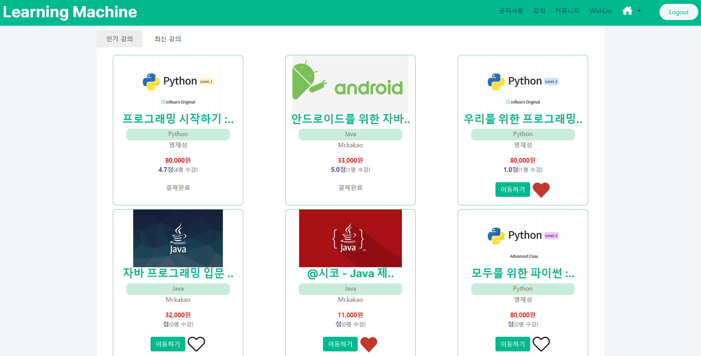
 로그인을 했을 경우의 강의목록입니다.<br>
 내가 결제했던 강의는 강의완료로 표시되며, 클릭하면 강의실로 이동합니다.<br>
 찜하기를 누르면 하트가 화면과 같이 색이 채워지며 찜하기가 됩니다.<br><br>
 
 ###  * 강의실
 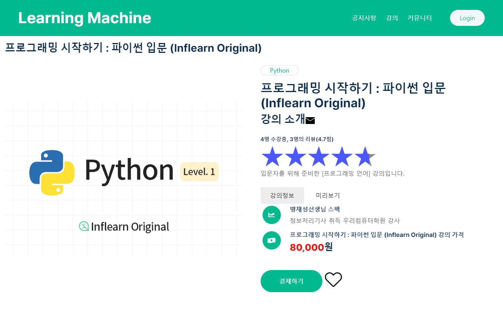
 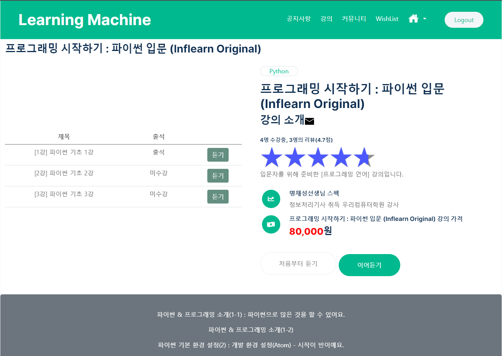
 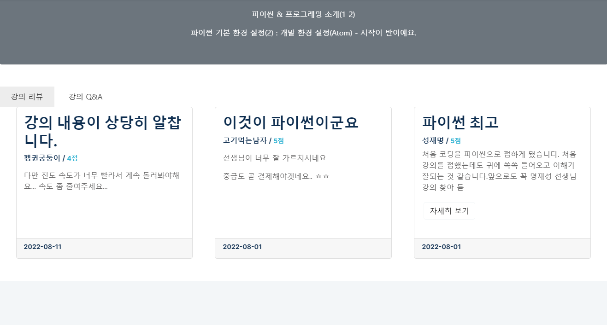
 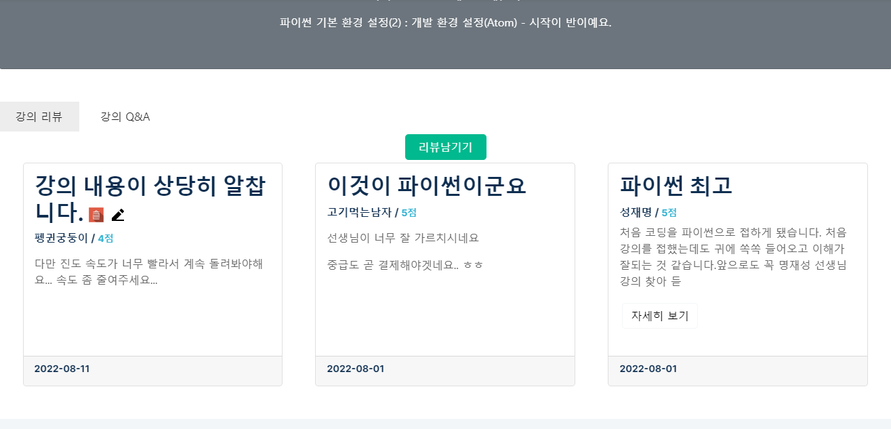
 
 
 ###  * 강의 결재
 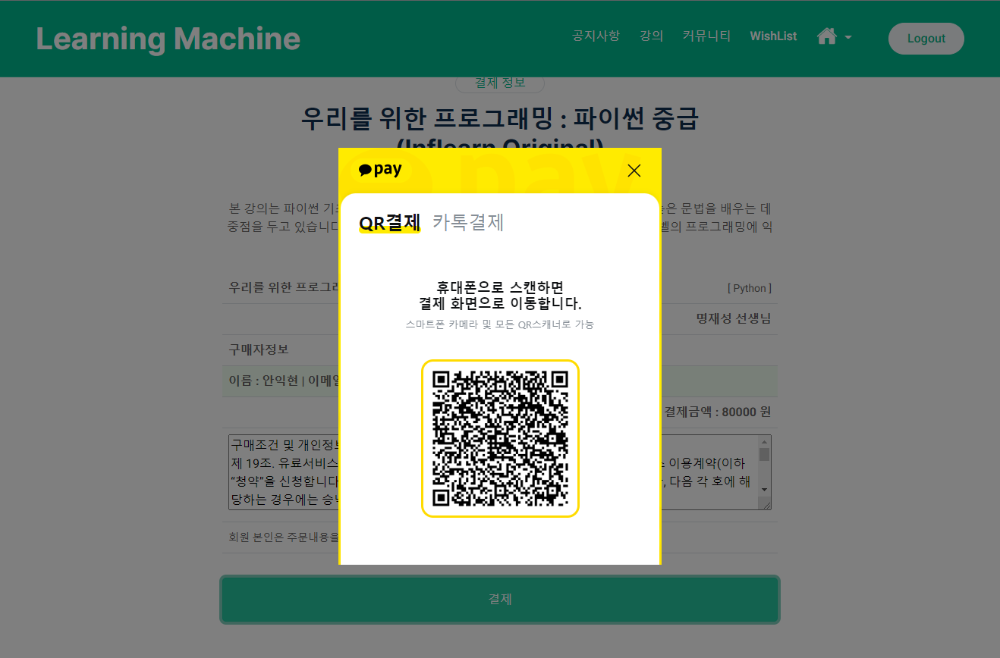
 
 ###  * 강의 영상
  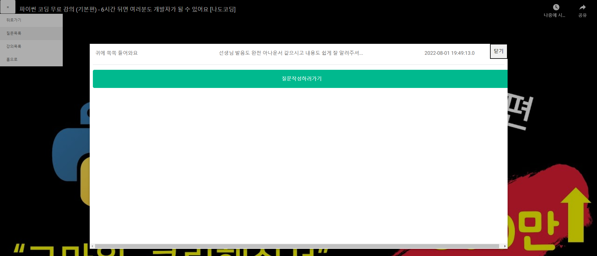
  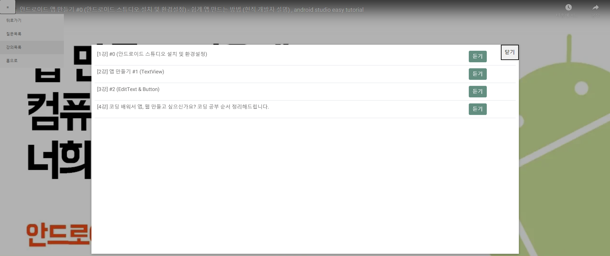
 
